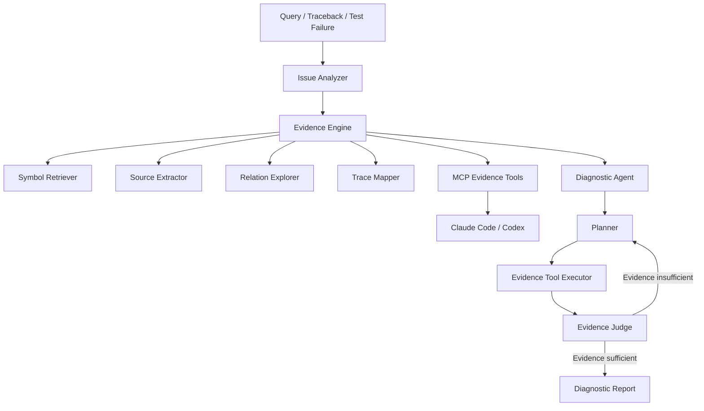

# RepoMind 智能体诊断架构重构方案

> **For agentic workers:** REQUIRED SUB-SKILL: Use superpowers:subagent-driven-development (recommended) or superpowers:executing-plans to implement this plan task-by-task. Steps use checkbox (`- [ ]`) syntax for tracking.

**Goal:** 将 RepoMind 重构为“确定性诊断证据引擎 + 可选多轮诊断 Agent + 标准 MCP Server”，既能独立体现智能体开发能力，也能为 Claude Code、Codex 等宿主智能体提供实际有价值的代码诊断能力。

**Architecture:** 基础服务只负责索引、检索、源码提取、Traceback 映射和调用关系计算，不直接执行最终 LLM 推理。独立 `DiagnosticAgent` 通过受控的多轮工具调用生成假设、评估证据充分性并形成报告；MCP 默认暴露确定性证据工具，同时可选暴露完整 Agent 工具。

**Tech Stack:** Python 3.13、uv、Pydantic v2、Tree-sitter、SQLite、sqlite-vec（可选）、NetworkX、LiteLLM、官方 Python MCP SDK、pytest。

## Global Constraints

- 所有开发和验证操作必须通过项目根目录 `.venv` 与 `uv` 完成。
- 不在代码或文档中硬编码 API Key；模型配置全部通过 `.env` 注入。
- qualified name 必须使用 project-relative path，不得包含本机绝对路径。
- 调用关系必须保留具体 `caller_qname`，不能折叠到类或模块。
- 增量索引必须保持幂等，并清理已经物理删除的文件、符号和图节点。
- LLM、Embedding 或网络不可用时，系统必须降级到本地证据模式，不能导致诊断服务整体失败。
- 第一阶段仅支持 Python；在完成真实评测前不扩展到其他语言。
- 第一阶段只提供只读诊断工具，不允许 Agent 任意生成并执行 Shell 命令。

---

## 1. 项目重新定位

RepoMind 不应宣传为另一个通用 Coding Agent。建议统一定位为：

> RepoMind 是面向 Python 代码仓库的诊断证据智能体。它通过 Tree-sitter、混合检索和静态调用图构建可复核的代码证据；既可以作为 MCP Server 向 Claude Code、Codex 提供诊断工具，也可以通过受控多轮 Agent 独立完成根因分析。

项目提供两种运行模式：

### Evidence Mode

不调用生成式 LLM，只返回结构化、可复核的证据：

```text
问题 / Traceback / 测试失败
    -> 解析问题
    -> 检索符号
    -> 映射源码
    -> 扩展调用关系
    -> 返回 Evidence Bundle
```

该模式应成为 MCP 工具的默认行为。

### Agent Mode

在 Evidence Mode 之上增加受控 LLM 决策：

```text
问题
    -> 生成检索计划
    -> 调用证据工具
    -> 更新根因假设
    -> 判断证据是否充分
    -> 继续检索或输出报告
```

该模式用于独立 CLI、演示智能体能力，以及可选的 MCP 高层工具。

## 2. 目标架构



架构边界：

- `services/`：确定性业务服务，不负责最终 LLM 推理。
- `agent/`：LLM 决策、假设更新、证据判断和循环控制。
- `mcp/`：协议适配，不承载业务规则。
- `reporter/`：把结构化结果渲染为 Markdown 或 JSON。
- `models/`：证据、诊断状态、工具动作和报告的数据约束。

## 3. 建议文件结构

```text
src/repomind/
├── agent/
│   ├── diagnostic_agent.py      # Agent 主循环
│   ├── planner.py               # 下一步工具决策
│   ├── evidence_judge.py        # 证据充分性判断
│   ├── reasoner.py              # LiteLLM 适配与结构化输出
│   ├── state.py                 # 诊断状态和轨迹
│   └── prompts.py               # 集中管理 Prompt
├── evidence/
│   ├── engine.py                # 统一证据编排入口
│   ├── source_extractor.py      # 按符号/行号读取源码
│   └── scorer.py                # 证据相关性与置信度计算
├── trace/
│   ├── base.py                  # TraceParser 接口
│   ├── python_traceback.py      # 标准 Python traceback
│   ├── pytest_failure.py        # pytest 失败输出
│   └── generic_log.py           # 有限的通用日志退避
├── mcp/
│   ├── server.py                # 官方 MCP SDK 服务入口
│   ├── tools.py                 # MCP 工具注册
│   └── workspace.py             # roots/cwd/repo_path 解析
└── models/
    ├── evidence.py              # Evidence 数据模型
    └── diagnostic.py            # Agent 状态与结果模型
```

应继续复用现有 `IndexService`、`QueryService`、`RCAService`、`SQLiteStore` 和 `GraphStore`，避免无必要的整体重写。

## 4. 统一数据模型

新增核心模型：

```python
from typing import Literal

from pydantic import BaseModel, Field


class Evidence(BaseModel):
    evidence_id: str
    source: Literal["trace", "search", "graph", "source", "test"]
    file_path: str
    symbol: str | None = None
    start_line: int | None = None
    end_line: int | None = None
    snippet: str | None = None
    relevance_score: float = Field(ge=0.0, le=1.0)
    reason: str
    metadata: dict[str, object] = Field(default_factory=dict)


class DiagnosticHypothesis(BaseModel):
    hypothesis_id: str
    description: str
    confidence: float = Field(ge=0.0, le=1.0)
    supporting_evidence_ids: list[str] = Field(default_factory=list)
    conflicting_evidence_ids: list[str] = Field(default_factory=list)


class ToolInvocation(BaseModel):
    tool_name: str
    arguments: dict[str, object]
    iteration: int
    success: bool
    new_evidence_ids: list[str] = Field(default_factory=list)
    error: str | None = None


class DiagnosticState(BaseModel):
    issue: str
    iteration: int = 0
    hypotheses: list[DiagnosticHypothesis] = Field(default_factory=list)
    evidences: list[Evidence] = Field(default_factory=list)
    tool_history: list[ToolInvocation] = Field(default_factory=list)
    stop_reason: str | None = None
```

模型约束：

- LLM 输出的结论只能引用已有 `evidence_id`。
- 没有证据支持的内容必须标记为推测。
- 文件路径必须经过 workspace 归一化。
- 不再使用固定 `0.8/0.4` 作为 RCA 置信度。
- 最终置信度至少应考虑证据数量、来源独立性、路径匹配精度和符号匹配精度。

## 5. 基础服务职责调整

### QueryService

修改 `src/repomind/services/query_service.py`：

- `search()` 只执行本地检索和结果排序。
- 默认支持返回源码片段。
- 返回各检索来源的原始排名和融合分数。
- 不在 `search()` 中生成所谓的 AI Answer。
- 将现有 `answer()` 移到 `agent/reasoner.py`，或仅作为兼容层调用新的 Reasoner。

建议默认参数：

```python
QueryOptions(
    max_results=8,
    include_code=True,
    graph_hops=1,
)
```

每条结果应至少包含：

- qualified name
- 文件路径
- 起止行号
- 源码片段
- BM25 排名
- keyword 排名
- vector 排名
- graph 排名
- RRF 分数
- 匹配原因

### RCAService

修改 `src/repomind/services/rca_service.py`：

- 只负责 traceback 解析、路径映射、符号匹配和证据构建。
- 移除直接的 `litellm.completion()`。
- 将结果明确拆成直接报错点和可能根因。
- 支持 chained exception。
- 输出缺失证据和解析警告。

建议将 `analyze_trace()` 改为：

```python
def collect_trace_evidence(self, trace: str) -> TraceEvidenceResult:
    ...
```

为避免一次性破坏现有 API，可先保留：

```python
def analyze_trace(self, trace: str) -> RCAResult:
    return self.collect_trace_evidence(trace).to_legacy_result()
```

### EvidenceEngine

新增统一入口：

```python
class EvidenceEngine:
    def search_symbols(self, query: str, limit: int = 8) -> list[Evidence]:
        ...

    def get_symbol_source(self, qualified_name: str) -> Evidence | None:
        ...

    def expand_relations(
        self,
        qualified_name: str,
        direction: Literal["callers", "callees", "both"],
        depth: int = 1,
    ) -> list[Evidence]:
        ...

    def find_failure_evidence(self, failure_text: str) -> EvidenceBundle:
        ...
```

## 6. DiagnosticAgent 设计

Agent 必须是受控状态机，而不是无限 ReAct 循环。

允许的工具：

- `search_symbols`
- `get_symbol_source`
- `find_callers`
- `find_callees`
- `expand_symbol_relations`
- `map_traceback`
- `search_tests`

第一版禁止：

- 任意 Shell 命令
- 修改源码
- 自动提交
- 网络搜索
- 无限制读取整个仓库

主循环：

```python
class DiagnosticAgent:
    def run(self, issue: str, max_iterations: int = 4) -> DiagnosticResult:
        state = DiagnosticState(issue=issue)

        while state.iteration < max_iterations:
            action = self.planner.next_action(state)
            invocation = self.executor.execute(action, state.iteration)
            state.tool_history.append(invocation)
            state.iteration += 1

            judgement = self.evidence_judge.evaluate(state)
            if judgement.sufficient:
                state.stop_reason = judgement.reason
                break

            if self._has_stalled(state):
                state.stop_reason = "no_new_evidence"
                break

        if state.stop_reason is None:
            state.stop_reason = "max_iterations_reached"

        return self.reasoner.summarize(state)
```

停止条件：

- Traceback 帧精确匹配到仓库内符号和源码。
- 某个根因假设至少有两条相互独立的支持证据。
- 连续两轮没有获得新证据。
- 达到最大迭代次数，默认 4，最大不得超过 5。
- 连续工具失败达到 2 次。

Agent 每一轮必须记录：

- 当前假设
- 选择的工具及理由
- 工具参数
- 新增证据
- 假设置信度变化
- 是否继续以及原因

## 7. MCP Server 重构

### 使用官方 SDK

替换 `src/repomind/mcp/server.py` 中手写的 JSON-RPC 循环，交给官方 Python MCP SDK处理：

- initialize 生命周期
- 协议版本协商
- `notifications/initialized`
- 工具输入校验
- structured content
- roots
- cancellation
- progress
- 工具错误和协议错误区分

不要固定返回 `2024-11-05`。

### Workspace 解析

新增 `src/repomind/mcp/workspace.py`，按以下优先级解析目标仓库：

1. 用户显式传入并通过校验的 `repo_path`
2. MCP roots 中匹配的工作区
3. `CLAUDE_PROJECT_DIR`
4. MCP Server 进程的 `cwd`

所有路径必须：

- 转为绝对规范路径。
- 验证目录存在。
- 验证索引目录位于目标仓库下。
- 防止通过 `..` 越过允许的 workspace root。

### MCP 工具

建议最终暴露六个工具。

#### `repomind.index_repository`

- 默认 `incremental=true`
- 返回文件数、符号数、调用边数、跳过数、错误和耗时
- 大仓库索引应发送 progress

#### `repomind.search_symbols`

- 返回结构化符号、源码片段和检索分数
- 不调用生成式 LLM

#### `repomind.get_symbol_source`

- 按 qualified name 返回完整函数或类源码
- 支持返回所在类和文件上下文

#### `repomind.expand_symbol_relations`

- 显式接受 `direction=callers|callees|both`
- 返回关系类型、解析策略和置信度
- 不把所有边混成没有方向的 BFS 列表

#### `repomind.find_failure_evidence`

- 输入 traceback 或 pytest 失败文本
- 返回 proximate cause、匹配帧、源码证据、调用关系和警告
- 不调用 LLM

#### `repomind.run_diagnostic_agent`

- 显式运行内部多轮 Agent
- 参数包含 `max_iterations`
- 返回完整轨迹摘要、假设、证据引用和停止原因

### MCP 返回格式

每个工具应同时返回文本摘要和 `structuredContent`：

```json
{
  "summary": "Matched traceback to service.login",
  "symbols": [],
  "evidences": [],
  "relations": [],
  "warnings": [],
  "degraded_features": []
}
```

错误处理：

- 缺少必要参数：JSON-RPC invalid params。
- 索引不存在：工具执行错误，`isError=true`，并提供下一步建议。
- 可选功能不可用：正常结果中返回 `degraded_features`。
- 内部异常：隐藏敏感绝对路径和密钥，不直接回传完整内部堆栈。

## 8. 检索能力改进

### 分词

BM25 tokenizer 增加：

- `snake_case` 拆分
- `CamelCase` 拆分
- 文件路径分段
- 异常类型识别
- 中文与英文混合查询
- 函数名、类名、文件名加权

### 检索排序

建议分层排序：

1. qualified name 精确匹配
2. symbol name 精确匹配
3. 文件名或异常帧匹配
4. BM25
5. keyword
6. vector
7. graph expansion

RRF 必须保存来源排名，不只保留最终分数。

### 源码上下文

- 默认返回函数或类完整范围。
- 单条源码默认不超过 80 行。
- 超过限制时保留签名、目标行附近代码和尾部异常处理。
- 不将整个大文件直接返回 MCP。

## 9. 调用图改进

必须保证：

- caller 使用具体 `caller_qname`。
- callers 和 callees 方向明确。
- unresolved callee 单独记录，不伪装成可靠图节点。
- 同名候选多于一个时降低置信度。
- 每条边记录解析策略。

建议关系结构：

```json
{
  "source": "app.service.login",
  "target": "app.repository.find_user",
  "relation": "calls",
  "confidence": 0.85,
  "resolution": "import_alias_match",
  "line_number": 42
}
```

需要明确记录的限制：

- 动态派发
- 依赖注入
- 装饰器注册
- 高阶回调
- monkey patch
- 运行时导入

这些场景不能声称调用图完全准确，应返回 warning。

## 10. Traceback 和测试失败解析

新增解析器接口：

```python
class TraceParser(Protocol):
    def can_parse(self, text: str) -> bool:
        ...

    def parse(self, text: str) -> ParsedFailure:
        ...
```

第一版支持：

- 标准 Python traceback
- chained exception
- pytest assertion failure
- `During handling of the above exception`
- `The above exception was the direct cause`
- Windows 与 POSIX 路径
- Docker/容器路径回映射

诊断输出应区分：

- `proximate_cause`：最终抛出异常的位置
- `likely_root_causes`：基于证据推测的根因候选
- `affected_path`：相关调用链
- `missing_evidence`：还缺少什么信息
- `verification_suggestions`：如何验证结论

## 11. sqlite-vec 与降级模式

当前 `sqlite-vec` 是可选依赖，但 `SQLiteStore` 无条件导入，应修复为真正可选。

建议行为：

```python
try:
    import sqlite_vec
except ImportError:
    sqlite_vec = None
```

- 未配置 embedding：运行 BM25 + keyword + graph。
- 配置了 embedding 但未安装 `sqlite-vec`：记录 warning，降级运行。
- 安装向量能力：

```bash
uv pip install -e ".[dev,vector]"
```

结果应包含：

```json
{
  "degraded_features": ["vector_search"]
}
```

## 12. 测试策略

### 单元测试

新增或强化：

- Evidence 模型验证
- traceback 和 chained exception 解析
- pytest 失败解析
- Agent 停止条件
- 连续无新证据停止
- 最大迭代限制
- LLM 结构化输出校验
- 不存在的 evidence ID 被拒绝
- caller/callee 方向
- 同名符号歧义
- unresolved callee
- RRF 来源排名
- 无 LLM 降级
- 无 sqlite-vec 降级

删除无效断言，例如：

```python
assert service.graph.node_count >= 0
```

替换为确定性断言：

```python
assert service.graph.node_count == 4
assert service.graph.edge_count == 2
```

### MCP 契约测试

必须用真实 MCP Client，而不只是直接调用 `handle_message()`：

- initialize
- notifications/initialized
- tools/list
- tools/call
- invalid arguments
- tool execution error
- structuredContent
- roots
- cancellation
- Server 日志不污染 stdout

### 端到端测试

每个测试创建临时 Python 仓库：

```text
写入缺陷代码
    -> 执行索引
    -> 提交 traceback 或 pytest 输出
    -> 调用 find_failure_evidence
    -> 验证目标文件、函数、行号和证据
```

至少覆盖：

- 单文件异常
- 跨文件调用
- 同名函数
- 修改后增量索引
- 删除文件后的图清理
- Docker 路径映射

### Agent 轨迹测试

使用 Mock Reasoner 返回固定动作，验证：

- 工具调用顺序
- 证据写入状态
- 假设更新
- 停止条件
- 不支持证据的结论不会进入最终报告

## 13. 评测设计

现有 5 个自身仓库案例不足以证明实际价值。建议准备至少 30 个可复现案例：

- 10 个明确 Python traceback
- 10 个 pytest 失败
- 5 个跨文件调用问题
- 5 个同名符号或歧义问题

对照组：

| 方案 | Top-1 文件 | Top-3 文件 | 函数命中 | 工具调用数 | Token | 时间 | 修复成功 |
|---|---:|---:|---:|---:|---:|---:|---:|
| 关键词搜索 | | | | | | | |
| RepoMind Evidence Mode | | | | | | | |
| Claude/Codex 原生 | | | | | | | |
| Claude/Codex + RepoMind | | | | | | | |
| RepoMind Agent Mode | | | | | | | |

指标：

- Root Cause File Hit Rate
- Root Cause Function Hit Rate
- Evidence Precision
- Evidence Coverage
- Unsupported Claim Rate
- 平均定位时间
- 平均工具调用次数
- 平均 Token 消耗
- 最终修复测试通过率

最重要的产品结论应是：

> 使用 RepoMind 后，宿主智能体能否用更少的工具调用和 Token 定位到正确文件与函数。

## 14. README 与项目文档

README 应增加：

- 新定位
- Evidence Mode 与 Agent Mode 的区别
- 架构图
- 一条完整 Agent 轨迹
- Claude Code MCP 配置
- Codex MCP 配置
- benchmark 运行方式
- 真实评测结果
- 已知限制
- 终端录屏或 GIF

未经可复现实验，不应继续使用以下宣传：

- 百万行项目 15 秒内索引
- Token 节省 90%+
- 类型推断准确率 70%+
- 微秒级完整拓扑分析
- 自动生成补丁并完成回归测试

## 15. 分阶段实施顺序

### P0：基础可用性

- [ ] 修复 `sqlite-vec` 可选依赖与降级模式。
- [ ] 修复 MCP workspace root 解析。
- [ ] 让搜索工具默认返回源码片段。
- [ ] 为 MCP 输出增加结构化内容。
- [ ] 使用官方 MCP SDK 替换手写协议循环。
- [ ] 增加真实 MCP Client 契约测试。

验收标准：

- 无 API Key、无 embedding、无 sqlite-vec 时仍可索引和搜索。
- Claude Code 与 Codex 均能成功初始化、列出工具并调用搜索。
- 搜索结果包含文件、符号、行号和源码。

### P1：双模式架构

- [ ] 从 `QueryService` 中移除最终 LLM 回答职责。
- [ ] 从 `RCAService` 中移除最终 LLM 根因推理。
- [ ] 新建统一 Evidence 模型和 EvidenceEngine。
- [ ] 新建 DiagnosticAgent 状态和受控循环。
- [ ] 实现证据引用校验和停止条件。
- [ ] MCP 暴露 `run_diagnostic_agent`。

验收标准：

- Evidence Mode 全程不调用生成式 LLM。
- Agent Mode 每轮都有可检查轨迹。
- 最终诊断中的每个核心结论均引用已存在证据。
- Agent 最多 5 轮且不会无限循环。

### P2：真实价值验证

- [ ] 建立 30～50 个真实缺陷案例。
- [ ] 建立 Claude/Codex 原生对照组。
- [ ] 记录 Token、耗时和工具调用次数。
- [ ] 输出 JSON 和 Markdown 评测报告。
- [ ] 在 README 展示可复现实验结果。

验收标准：

- 评测数据可以通过单一命令复现。
- 报告明确展示 RepoMind 的收益和失败案例。
- 不隐藏无法解析的动态调用和错误诊断。

### P3：后续扩展

只有 P0～P2 完成后再考虑：

- JavaScript/TypeScript
- Jedi/LSP 增强
- 动态调用图
- 沙箱测试执行
- 自动补丁生成
- 自动回归验证

## 16. 推荐的具体任务拆分

### Task 1：可选向量依赖

**Files:**

- Modify: `pyproject.toml`
- Modify: `src/repomind/storage/sqlite_store.py`
- Modify: `src/repomind/core/retrieval/hybrid_retriever.py`
- Test: `tests/unit/test_sqlite_store.py`
- Test: `tests/unit/test_retriever.py`

交付物：

- 不安装 `sqlite-vec` 时基础检索可运行。
- 向量不可用时返回明确降级状态。

### Task 2：统一 Evidence 模型

**Files:**

- Create: `src/repomind/models/evidence.py`
- Create: `src/repomind/models/diagnostic.py`
- Modify: `src/repomind/models/__init__.py`
- Test: `tests/unit/test_evidence_models.py`

交付物：

- Evidence、EvidenceBundle、Hypothesis、DiagnosticState 和 ToolInvocation。

### Task 3：EvidenceEngine

**Files:**

- Create: `src/repomind/evidence/engine.py`
- Create: `src/repomind/evidence/source_extractor.py`
- Modify: `src/repomind/services/query_service.py`
- Test: `tests/integration/test_evidence_engine.py`

交付物：

- 统一的搜索、源码读取和关系扩展接口。

### Task 4：Trace Parser

**Files:**

- Create: `src/repomind/trace/base.py`
- Create: `src/repomind/trace/python_traceback.py`
- Create: `src/repomind/trace/pytest_failure.py`
- Modify: `src/repomind/services/rca_service.py`
- Test: `tests/unit/test_trace_parsers.py`

交付物：

- Python traceback、异常链和 pytest 失败的结构化解析。

### Task 5：调用图可信度

**Files:**

- Modify: `src/repomind/core/call_graph/resolver.py`
- Modify: `src/repomind/core/call_graph/graph_builder.py`
- Modify: `src/repomind/storage/graph_store.py`
- Test: `tests/unit/test_resolver.py`
- Test: `tests/unit/test_call_graph.py`

交付物：

- caller/callee 方向、解析策略、置信度和 unresolved 记录。

### Task 6：官方 MCP SDK

**Files:**

- Modify: `pyproject.toml`
- Replace: `src/repomind/mcp/server.py`
- Create: `src/repomind/mcp/tools.py`
- Create: `src/repomind/mcp/workspace.py`
- Create: `tests/integration/test_mcp_server.py`

交付物：

- 标准生命周期、工具注册、workspace roots 和结构化结果。

### Task 7：DiagnosticAgent

**Files:**

- Create: `src/repomind/agent/state.py`
- Create: `src/repomind/agent/planner.py`
- Create: `src/repomind/agent/evidence_judge.py`
- Create: `src/repomind/agent/reasoner.py`
- Create: `src/repomind/agent/diagnostic_agent.py`
- Create: `src/repomind/agent/prompts.py`
- Test: `tests/unit/test_diagnostic_agent.py`

交付物：

- 最多 5 轮、可追踪、可降级的诊断 Agent。

### Task 8：CLI 双模式

**Files:**

- Modify: `src/repomind/cli/app.py`
- Modify: `src/repomind/cli/commands/rca.py`
- Modify: `src/repomind/reporter/evidence_report.py`
- Test: `tests/unit/test_cli.py`

交付物：

```bash
uv run repomind diagnose error.log --mode evidence
uv run repomind diagnose error.log --mode agent
```

### Task 9：真实评测

**Files:**

- Create: `eval/cases/`
- Create: `eval/run_host_comparison.py`
- Modify: `src/repomind/eval/evaluator.py`
- Create: `docs/testing/agent_benchmark.md`

交付物：

- 至少 30 个可复现案例。
- Evidence Mode、Agent Mode 和宿主原生能力的对比报告。

### Task 10：文档与演示

**Files:**

- Modify: `README.md`
- Modify: `docs/mcp_usage.md`
- Modify: `.env.example`
- Create: `docs/design/agent_architecture.md`

交付物：

- 可直接复制的 Claude Code 和 Codex 配置。
- Agent 轨迹示例。
- 真实评测结果和已知限制。

## 17. 面试与简历表达

推荐简历描述：

> 设计并实现面向 Python 仓库的双模式诊断智能体 RepoMind：基于 Tree-sitter、BM25/向量检索、RRF 与静态调用图构建可复核代码证据链；通过受控多轮 Agent 完成检索规划、根因假设和证据充分性判断；以 MCP Server 接入 Claude Code/Codex，并支持 LLM 或网络不可用时降级为确定性证据模式。

面试时应重点说明：

1. 为什么不在每个服务中都调用一次 LLM。
2. 为什么确定性证据和概率性推理必须分层。
3. Agent 如何避免无限循环和无依据结论。
4. MCP 工具如何帮助宿主减少文件遍历和 Token 消耗。
5. 如何通过对照实验而不是 README 宣传证明项目价值。

## 18. 最终完成标准

项目达到以下标准后，才适合声称能够实际增强 Claude Code 或 Codex：

- Claude Code 和 Codex 均通过真实 MCP Client 测试。
- Evidence Mode 不依赖 LLM 也能定位 traceback 相关代码。
- Agent Mode 有完整、可复核的工具轨迹和停止原因。
- 搜索和诊断结果包含准确文件路径、符号、行号和源码证据。
- 调用图返回方向、解析策略和置信度。
- 至少 30 个真实案例完成对照评测。
- 能展示工具调用数、Token 或定位准确率中的明确收益。
- 文档明确披露动态 Python 场景中的静态分析限制。
