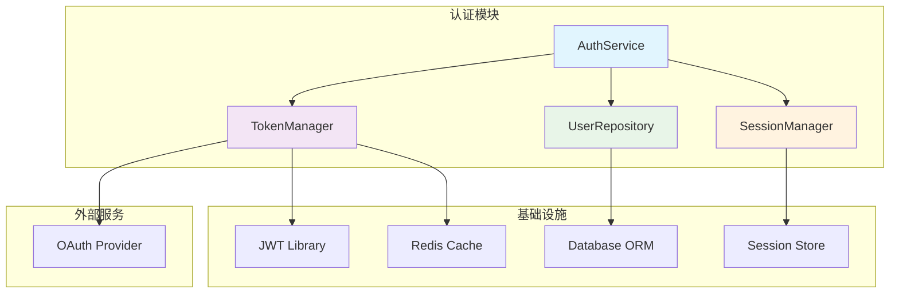

# 产品设计文档（Product Design Document）

## 1. 产品概述

### 1.1 产品定位

**RepoMind** 是一款面向大型代码仓库的 **Repository Intelligence Platform**，旨在通过静态分析、图谱检索和 AI 推理的深度融合，帮助开发者快速理解代码架构、精准定位问题根因。

**一句话定位**：
> 本地优先的代码仓库智能外脑，让百万行代码一目了然。

### 1.2 核心价值主张

| 价值维度 | 传统方式 | RepoMind |
|---------|---------|----------|
| **代码理解** | 手动阅读 + grep | 图谱拓扑 + 语义检索 |
| **问题定位** | 经验驱动 + 反复试错 | Trace 逆向 + 沙箱验证 |
| **架构可视化** | 手绘 + 文档维护 | 自动生成 Mermaid 图 |
| **Token 消耗** | ~41 万 Tokens/次 | ~5,000 Tokens/次 |
| **上手成本** | 配置复杂 | 零配置开箱即用 |

### 1.3 目标用户画像

#### 画像 A：新人开发者（Onboarding）

```
姓名：小明
职位：初级后端工程师
背景：刚加入团队，接手一个 50 万行的 Python 项目
痛点：
  - 不了解系统整体架构
  - 难以理解历史代码的设计意图
  - 手动追踪调用链耗时耗力
使用场景：
  1. 快速了解项目结构
  2. 追踪某个功能的调用链路
  3. 理解模块间的依赖关系
```

#### 画像 B：架构师（Architecture Analysis）

```
姓名：老王
职位：系统架构师
背景：需要评估一个开源项目是否适合引入
痛点：
  - 需要快速理解复杂系统的架构
  - 避免繁琐的环境配置
  - 需要可视化工具辅助分析
使用场景：
  1. 分析项目的核心模块
  2. 识别关键依赖和风险点
  3. 生成架构文档
```

#### 画像 C：SRE/开发工程师（RCA）

```
姓名：小李
职位：SRE 工程师
背景：生产环境出现异常，需要快速定位根因
痛点：
  - 分布式系统故障定位困难
  - 多文件依赖导致根因分析复杂
  - 手动排查耗时，影响系统恢复时间
使用场景：
  1. 输入 Stack Trace 自动定位问题
  2. 生成修复建议
  3. 在沙箱中验证修复方案
```

---

## 2. 产品架构

### 2.1 信息架构

```
RepoMind CLI
├── 索引管理 (index)
│   ├── 全量索引构建
│   ├── 增量索引更新
│   ├── 索引状态查看
│   └── 索引清理
├── 智能查询 (query)
│   ├── 关键字检索 (BM25)
│   ├── 语义检索 (Vector)
│   ├── 混合检索 (Hybrid)
│   └── 图拓扑扩展
├── 根因分析 (rca)
│   ├── Stack Trace 分析
│   ├── Issue 描述分析
│   ├── 修复建议生成
│   └── 沙箱验证
├── 可视化 (visualize)
│   ├── 调用图
│   ├── 依赖图
│   ├── 继承图
│   └── 导出 Mermaid
└── 系统管理 (admin)
    ├── 统计信息
    ├── 配置管理
    ├── 缓存清理
    └── 日志查看
```

### 2.2 用户旅程图

```
┌─────────────────────────────────────────────────────────────────┐
│                    User Journey Map                              │
├─────────────────────────────────────────────────────────────────┤
│                                                                 │
│  ┌─────────┐    ┌─────────┐    ┌─────────┐    ┌─────────┐      │
│  │  安装   │───▶│  索引   │───▶│  查询   │───▶│  可视化 │      │
│  │  配置   │    │  构建   │    │  分析   │    │  输出   │      │
│  └─────────┘    └─────────┘    └─────────┘    └─────────┘      │
│       │              │              │              │            │
│       v              v              v              v            │
│  ┌─────────┐    ┌─────────┐    ┌─────────┐    ┌─────────┐      │
│  │ pip     │    │ repomind│    │ repomind│    │ Mermaid │      │
│  │ install │    │ index   │    │ query   │    │ 图表    │      │
│  │ repomind│    │ ./myproj│    │ "..."   │    │ 输出    │      │
│  └─────────┘    └─────────┘    └─────────┘    └─────────┘      │
│                                                                 │
│  情感曲线：                                                      │
│  😐 ──── 😊 ──── 😄 ──── 🤩                                    │
│  安装    索引    查询    可视化                                  │
│                                                                 │
└─────────────────────────────────────────────────────────────────┘
```

---

## 3. 功能设计

### 3.1 核心功能模块

#### 3.1.1 索引构建模块

**功能描述**：将代码仓库解析为结构化的索引数据

**用户故事**：
- 作为开发者，我希望能够快速索引我的项目，以便后续查询
- 作为开发者，我希望支持增量更新，避免重复索引

**交互流程**：

```
用户输入                    系统处理                      输出结果
─────────                  ─────────                    ─────────
                           ┌─────────────────┐
repomind index             │ 1. 路径验证      │
./my-project        ────▶  │ 2. 文件扫描      │   ────▶  ✅ 索引完成
                           │ 3. AST 解析      │          📊 统计信息
                           │ 4. 类型推断      │
                           │ 5. 图谱构建      │
                           │ 6. 向量编码      │
                           └─────────────────┘
```

**输出示例**：

```
╭──────────────────────────────────────────────────────────────╮
│                    RepoMind Index Builder                     │
├──────────────────────────────────────────────────────────────┤
│                                                              │
│  📁 项目路径: ./my-project                                   │
│  🔍 扫描文件: 1,234 个 Python 文件                           │
│                                                              │
│  ⏳ 解析进度: [████████████████████████████] 100%            │
│                                                              │
│  📊 索引统计:                                                 │
│  ├── 类 (Classes):     156 个                                │
│  ├── 函数 (Functions): 2,345 个                              │
│  ├── 导入 (Imports):   4,567 条                              │
│  └── 调用 (Calls):     12,890 条                             │
│                                                              │
│  ⏱️  耗时: 12.3 秒                                           │
│  💾 存储: .repomind/ (15.6 MB)                               │
│                                                              │
╰──────────────────────────────────────────────────────────────┘
```

#### 3.1.2 智能查询模块

**功能描述**：支持多种检索方式，快速定位代码

**用户故事**：
- 作为开发者，我希望能够用自然语言描述需求，找到相关代码
- 作为开发者，我希望看到代码的完整调用链路

**查询模式**：

| 模式 | 说明 | 示例 |
|------|------|------|
| 关键字 | 精确匹配符号名 | `repomind query "UserService.validate_token"` |
| 语义 | 自然语言描述 | `repomind query "用户认证相关的代码"` |
| 混合 | 结合两者 | `repomind query "token验证" --hybrid` |
| 图扩展 | 带调用链 | `repomind query "支付处理" --expand 2` |

**交互流程**：

```
用户输入                    系统处理                      输出结果
─────────                  ─────────                    ─────────
                           ┌─────────────────┐
repomind query             │ 1. 查询解析      │
"用户认证流程"      ────▶  │ 2. BM25 检索    │   ────▶  📋 结果列表
--expand 2                 │ 3. 向量检索      │          🔗 调用链路
                           │ 4. 结果融合      │          📊 Mermaid 图
                           │ 5. 图拓扑扩展    │
                           └─────────────────┘
```

**输出示例**：

```
╭──────────────────────────────────────────────────────────────╮
│                    Query: "用户认证流程"                      │
├──────────────────────────────────────────────────────────────┤
│                                                              │
│  🔍 检索结果 (Top 5):                                        │
│                                                              │
│  1. auth/service.py::AuthService.authenticate (Score: 0.95) │
│     └── 认证服务主入口，处理登录请求                          │
│                                                              │
│  2. auth/token.py::TokenManager.verify (Score: 0.89)        │
│     └── JWT Token 验证逻辑                                   │
│                                                              │
│  3. auth/models.py::User.authenticate (Score: 0.85)         │
│     └── 用户模型认证方法                                     │
│                                                              │
│  🔗 调用链路 (2-hop):                                        │
│                                                              │
│  AuthService.authenticate                                    │
│  ├── TokenManager.verify                                     │
│  │   ├── JWT.decode                                          │
│  │   └── TokenCache.get                                      │
│  ├── User.get_by_id                                          │
│  │   └── Database.query                                      │
│  └── Session.create                                          │
│                                                              │
│  📊 架构图:                                                  │
│                                                              │
│  graph TD                                                    │
│      A[AuthService] --> B[TokenManager]                      │
│      B --> C[JWT]                                            │
│      B --> D[TokenCache]                                     │
│      A --> E[User]                                           │
│      E --> F[Database]                                       │
│      A --> G[Session]                                        │
│                                                              │
╰──────────────────────────────────────────────────────────────╯
```

#### 3.1.3 根因分析模块

**功能描述**：基于 Stack Trace 自动定位问题根因

**用户故事**：
- 作为 SRE，我希望输入 Stack Trace 后能自动定位问题
- 作为开发者，我希望获得修复建议并验证

**交互流程**：

```
用户输入                    系统处理                      输出结果
─────────                  ─────────                    ─────────
                           ┌─────────────────┐
repomind rca               │ 1. Trace 解析    │
--trace error.log    ────▶ │ 2. 符号定位      │   ────▶  🎯 根因定位
                           │ 3. 图谱扩展      │          💡 修复建议
                           │ 4. LLM 分析      │          ✅ 沙箱验证
                           │ 5. 修复生成      │
                           │ 6. 沙箱验证      │
                           └─────────────────┘
```

**Stack Trace 解析示例**：

```
输入 Stack Trace:
─────────────────
Traceback (most recent call last):
  File "app/services/payment.py", line 45, in process_payment
    result = gateway.charge(amount, token)
  File "app/gateways/stripe.py", line 78, in charge
    response = stripe.PaymentIntent.create(...)
  File "venv/lib/python3.13/stripe/api_requestor.py", line 120
    raise InvalidRequestError(message)
stripe.error.InvalidRequestError: No such token: 'tok_xxx'
```

**输出示例**：

```
╭──────────────────────────────────────────────────────────────╮
│                    Root Cause Analysis                        │
├──────────────────────────────────────────────────────────────┤
│                                                              │
│  🎯 根因定位:                                                │
│  ├── 问题文件: app/gateways/stripe.py:78                     │
│  ├── 问题函数: StripeGateway.charge                          │
│  └── 错误类型: InvalidRequestError                           │
│                                                              │
│  📊 调用链路:                                                │
│                                                              │
│  PaymentService.process_payment                              │
│  └── StripeGateway.charge                                    │
│      └── stripe.PaymentIntent.create                         │
│          └── ❌ InvalidRequestError                          │
│                                                              │
│  💡 根因分析:                                                │
│  Token 'tok_xxx' 已过期或不存在。                            │
│  可能原因：                                                  │
│  1. 前端传递了无效的 Token                                   │
│  2. Token 已被使用过                                         │
│  3. Stripe API 版本不兼容                                    │
│                                                              │
│  🔧 修复建议:                                                │
│                                                              │
│  ```diff                                                     │
│  - result = gateway.charge(amount, token)                    │
│  + try:                                                      │
│  +     result = gateway.charge(amount, token)                │
│  + except InvalidRequestError as e:                          │
│  +     if 'No such token' in str(e):                         │
│  +         raise PaymentError('Invalid payment token')       │
│  +     raise                                                │
│  ```                                                         │
│                                                              │
│  🧪 沙箱验证:                                                │
│  ├── 测试用例: test_charge_invalid_token                     │
│  ├── 执行结果: ✅ PASSED                                     │
│  └── 回归测试: ✅ 45/45 PASSED                               │
│                                                              │
╰──────────────────────────────────────────────────────────────╯
```

#### 3.1.4 可视化模块

**功能描述**：生成架构可视化图表

**用户故事**：
- 作为架构师，我希望可视化项目的模块依赖关系
- 作为开发者，我希望看到某个功能的调用流程

**可视化类型**：

| 类型 | 说明 | 用途 |
|------|------|------|
| 调用图 | 函数/方法调用关系 | 理解执行流程 |
| 依赖图 | 模块依赖关系 | 分析耦合度 |
| 继承图 | 类继承关系 | 理解 OOP 结构 |
| 导入图 | 模块导入关系 | 分析模块边界 |

**交互流程**：

```
用户输入                    系统处理                      输出结果
─────────                  ─────────                    ─────────
                           ┌─────────────────┐
repomind visualize         │ 1. 符号查找      │
AuthService         ────▶  │ 2. 图谱提取      │   ────▶  📊 Mermaid 图
--depth 3                  │ 3. 布局计算      │          📁 HTML 文件
--format mermaid           │ 4. 渲染输出      │
                           └─────────────────┘
```

**输出示例**：



---

## 4. 交互设计

### 4.1 CLI 命令设计原则

| 原则 | 说明 | 示例 |
|------|------|------|
| **一致性** | 命令结构统一 | `repomind <command> [args] [options]` |
| **可发现性** | 提供帮助信息 | `repomind --help` |
| **容错性** | 友好的错误提示 | 路径不存在时给出明确提示 |
| **渐进式** | 从简单到复杂 | 基础用法简单，高级选项可选 |

### 4.2 输出格式设计

#### 4.2.1 彩色终端输出

```python
from rich.console import Console
from rich.table import Table
from rich.panel import Panel
from rich.tree import Tree
from rich.syntax import Syntax

console = Console()

def display_results(results):
    """显示查询结果"""
    # 创建结果表格
    table = Table(title="Query Results")
    table.add_column("Score", style="cyan")
    table.add_column("Symbol", style="green")
    table.add_column("File", style="yellow")
    table.add_column("Description", style="white")

    for result in results:
        table.add_row(
            f"{result.score:.2f}",
            result.symbol_name,
            result.file_path,
            result.description
        )

    console.print(table)
```

#### 4.2.2 调用链树形展示

```python
def display_call_tree(root_node, depth=2):
    """显示调用链树"""
    tree = Tree(f"🔗 {root_node.name}")

    def add_children(node, tree, current_depth):
        if current_depth >= depth:
            return

        for child in node.children:
            child_tree = tree.add(
                f"{'├──' if child != node.children[-1] else '└──'} "
                f"{child.name} ({child.file}:{child.line})"
            )
            add_children(child, child_tree, current_depth + 1)

    add_children(root_node, tree, 0)
    console.print(tree)
```

### 4.3 错误处理设计

```python
class RepoMindError(Exception):
    """基础异常类"""
    pass

class IndexNotFoundError(RepoMindError):
    """索引不存在"""
    def __init__(self, path: str):
        super().__init__(
            f"索引不存在: {path}\n"
            f"请先运行: repomind index {path}"
        )

class SymbolNotFoundError(RepoMindError):
    """符号未找到"""
    def __init__(self, symbol: str):
        super().__init__(
            f"未找到符号: {symbol}\n"
            f"可能原因:\n"
            f"  1. 符号名称拼写错误\n"
            f"  2. 符号未被索引\n"
            f"  3. 符号位于外部依赖中"
        )

class SandboxError(RepoMindError):
    """沙箱执行错误"""
    def __init__(self, message: str):
        super().__init__(
            f"沙箱执行失败: {message}\n"
            f"请检查:\n"
            f"  1. Docker 是否已安装\n"
            f"  2. 沙箱镜像是否存在\n"
            f"  3. 系统资源是否充足"
        )
```

---

## 5. 数据设计

### 5.1 数据流图

```
┌─────────────────────────────────────────────────────────────────┐
│                        Data Flow Diagram                        │
├─────────────────────────────────────────────────────────────────┤
│                                                                 │
│   ┌─────────┐                                                  │
│   │  源代码  │                                                  │
│   └────┬────┘                                                  │
│        │                                                        │
│        v                                                        │
│   ┌─────────┐     ┌─────────┐     ┌─────────┐                  │
│   │  解析器  │────▶│  AST    │────▶│  符号   │                  │
│   │(Parser) │     │         │     │ 提取器  │                  │
│   └─────────┘     └─────────┘     └────┬────┘                  │
│                                        │                        │
│                    ┌───────────────────┼───────────────────┐    │
│                    v                   v                   v    │
│              ┌─────────┐         ┌─────────┐         ┌─────────┐
│              │  SQLite │         │ LanceDB │         │ NetworkX│
│              │(结构化) │         │ (向量)  │         │ (图)    │
│              └────┬────┘         └────┬────┘         └────┬────┘
│                   │                   │                   │
│                   └───────────────────┼───────────────────┘
│                                       v
│                               ┌─────────────┐
│                               │   查询引擎   │
│                               │  (Retriever) │
│                               └──────┬──────┘
│                                      │
│                    ┌─────────────────┼─────────────────┐
│                    v                 v                 v
│              ┌─────────┐       ┌─────────┐       ┌─────────┐
│              │  BM25   │       │  Vector │       │  Graph  │
│              │  检索   │       │  检索   │       │  扩展   │
│              └────┬────┘       └────┬────┘       └────┬────┘
│                   │                 │                 │
│                   └─────────────────┼─────────────────┘
│                                     v
│                             ┌─────────────┐
│                             │  结果融合    │
│                             │   输出      │
│                             └─────────────┘
│                                                                 │
└─────────────────────────────────────────────────────────────────┘
```

### 5.2 数据模型

```python
from dataclasses import dataclass
from typing import List, Optional, Dict, Any
from datetime import datetime

@dataclass
class File:
    """文件模型"""
    id: int
    path: str
    hash: str
    language: str
    line_count: int
    created_at: datetime
    updated_at: datetime

@dataclass
class Symbol:
    """符号模型"""
    id: int
    file_id: int
    name: str
    type: str  # 'class', 'function', 'method'
    qualified_name: str
    start_line: int
    end_line: int
    docstring: Optional[str]
    signature: Optional[str]
    is_exported: bool

@dataclass
class TypeInfo:
    """类型信息模型"""
    id: int
    symbol_id: int
    parameter_name: Optional[str]
    type_annotation: Optional[str]
    inferred_type: Optional[str]
    confidence: float
    inference_strategy: str

@dataclass
class Import:
    """导入关系模型"""
    id: int
    file_id: int
    module_path: str
    imported_name: Optional[str]
    alias: Optional[str]
    is_relative: bool
    relative_level: int

@dataclass
class Call:
    """调用关系模型"""
    id: int
    caller_id: int
    callee_id: int
    call_type: str  # 'direct', 'method', 'self', 'duck'
    confidence: float
    line_number: int

@dataclass
class Inherit:
    """继承关系模型"""
    id: int
    child_id: int
    parent_id: int
    parent_name: str
```

---

## 6. 视觉设计

### 6.1 终端配色方案

```python
# 配色方案
COLORS = {
    'primary': '#4FC3F7',      # 主色调 - 蓝色
    'secondary': '#81C784',    # 辅助色 - 绿色
    'accent': '#FFB74D',       # 强调色 - 橙色
    'error': '#E57373',        # 错误色 - 红色
    'warning': '#FFD54F',      # 警告色 - 黄色
    'success': '#81C784',      # 成功色 - 绿色
    'info': '#64B5F6',         # 信息色 - 浅蓝
    'muted': '#9E9E9E',        # 弱化色 - 灰色
}

# 终端样式
STYLES = {
    'title': 'bold cyan',
    'subtitle': 'bold white',
    'symbol': 'green',
    'file': 'yellow',
    'score': 'cyan',
    'error': 'bold red',
    'warning': 'bold yellow',
    'success': 'bold green',
    'info': 'blue',
}
```

### 6.2 输出面板设计

```
╭──────────────────────────────────────────────────────────────╮
│                    🧠 RepoMind v1.0.0                        │
├──────────────────────────────────────────────────────────────┤
│                                                              │
│  命令: repomind query "用户认证"                              │
│  状态: ✅ 执行成功                                           │
│                                                              │
╰──────────────────────────────────────────────────────────────╯
```

### 6.3 进度条设计

```
⏳ 索引进度:
[████████████████████████░░░░░░░░░░] 65% | 1234/1890 files | ETA: 00:05

📊 解析统计:
├── 类:     156 个 ✅
├── 函数:   2,345 个 ✅
├── 导入:   4,567 条 ✅
└── 调用:   12,890 条 🔄
```

---

## 7. MVP 功能清单

### 7.1 P0 核心功能（必须实现）

| 功能 | 优先级 | 预估工时 | 说明 |
|------|--------|---------|------|
| 项目索引构建 | P0 | 1 天 | 支持 Python 项目全量索引 |
| 符号提取 | P0 | 0.5 天 | 类、函数、导入提取 |
| 类型推断 | P0 | 1 天 | 渐进式类型推断算法 |
| 调用图构建 | P0 | 0.5 天 | 基础调用关系图 |
| BM25 检索 | P0 | 0.5 天 | 关键字精确检索 |
| 向量检索 | P0 | 0.5 天 | 语义相似度检索 |
| 图拓扑扩展 | P0 | 0.5 天 | 2-hop 扩展 |
| Exception 解析 | P0 | 0.5 天 | Stack Trace 解析 |
| Mermaid 输出 | P0 | 0.5 天 | 调用图可视化 |
| CLI 框架 | P0 | 0.5 天 | Typer 命令行 |

### 7.2 P1 重要功能（应该实现）

| 功能 | 优先级 | 预估工时 | 说明 |
|------|--------|---------|------|
| 混合检索 | P1 | 0.5 天 | BM25 + 向量融合 |
| RCA 报告生成 | P1 | 0.5 天 | LLM 根因分析 |
| 沙箱测试 | P1 | 1 天 | Docker 沙箱验证 |
| 增量更新 | P1 | 0.5 天 | 文件变更检测 |
| 彩色输出 | P1 | 0.5 天 | Rich 终端美化 |

### 7.3 P2 增强功能（可以实现）

| 功能 | 优先级 | 预估工时 | 说明 |
|------|--------|---------|------|
| HTML 报告 | P2 | 0.5 天 | 生成 HTML 报告 |
| 统计面板 | P2 | 0.5 天 | 索引统计信息 |
| 配置文件 | P2 | 0.5 天 | YAML 配置支持 |
| 日志系统 | P2 | 0.5 天 | 结构化日志 |

---

## 8. 成功指标

### 8.1 产品指标

| 指标 | 目标值 | 说明 |
|------|--------|------|
| 索引速度 | ≤ 15s/10万行 | 10 万行项目索引时间 |
| 查询延迟 | ≤ 100ms | 单次查询端到端延迟 |
| 类型推断准确率 | ≥ 70% | 无 Type Hints 场景 |
| 调用图精度 | ≥ 85% | 有 Type Hints 场景 |
| Token 节省 | ≥ 90% | 相比传统方式 |

### 8.2 用户体验指标

| 指标 | 目标值 | 说明 |
|------|--------|------|
| 首次使用时间 | ≤ 5 分钟 | 从安装到首次查询 |
| 学习曲线 | ≤ 30 分钟 | 掌握核心功能时间 |
| 错误率 | ≤ 5% | 用户操作失败率 |
| 满意度 | ≥ 4.0/5.0 | 用户满意度评分 |

---

## 9. 竞品分析

### 9.1 竞品对比矩阵

| 特性 | RepoMind | Cursor | Aider | Claude Code |
|------|----------|--------|-------|-------------|
| **本地优先** | ✅ | ❌ | ❌ | ❌ |
| **零配置** | ✅ | ❌ | ❌ | ❌ |
| **图谱检索** | ✅ | ❌ | ❌ | ❌ |
| **类型推断** | ✅ | ❌ | ❌ | ❌ |
| **沙箱验证** | ✅ | ❌ | ❌ | ❌ |
| **Token 效率** | ⭐⭐⭐⭐⭐ | ⭐⭐ | ⭐⭐ | ⭐⭐⭐ |
| **离线工作** | ✅ | ❌ | ❌ | ❌ |

### 9.2 差异化优势

1. **本地优先架构**：所有数据存储在本地，无需上传代码
2. **图谱增强检索**：基于代码结构的精准检索，而非简单文本匹配
3. **渐进式类型推断**：专为 Python 动态类型设计的推断算法
4. **沙箱自愈验证**：在隔离环境中验证修复方案

---

## 10. 路线图

### 10.1 MVP 阶段（第 1 周）

```
Day 1-2: 核心解析引擎
├── Tree-sitter 集成
├── 符号提取
└── SQLite 存储

Day 3-4: 检索与查询
├── BM25 检索
├── 向量检索
└── 图拓扑扩展

Day 5-6: RCA 与验证
├── Stack Trace 解析
├── LLM 根因分析
└── 沙箱测试

Day 7: 集成与美化
├── CLI 集成
├── 输出美化
└── 文档完善
```

### 10.2 V1.0 阶段（第 2-3 周）

- 完善类型推断算法
- 优化检索准确率
- 增强 RCA 能力
- 添加更多可视化选项

### 10.3 V2.0 阶段（第 4-6 周）

- 支持更多语言（Java, JavaScript）
- Web UI 界面
- 团队协作功能
- 插件系统

---

## 11. 附录

### 11.1 术语表

| 术语 | 说明 |
|------|------|
| RCA | Root Cause Analysis，根因分析 |
| BM25 | Best Matching 25，经典信息检索算法 |
| AST | Abstract Syntax Tree，抽象语法树 |
| MRO | Method Resolution Order，方法解析顺序 |

### 11.2 参考资料

1. SWE-bench: https://www.swebench.com/
2. Agentless: https://github.com/OpenAutoCoder/Agentless
3. Rich: https://rich.readthedocs.io/
4. Typer: https://typer.tiangolo.com/
