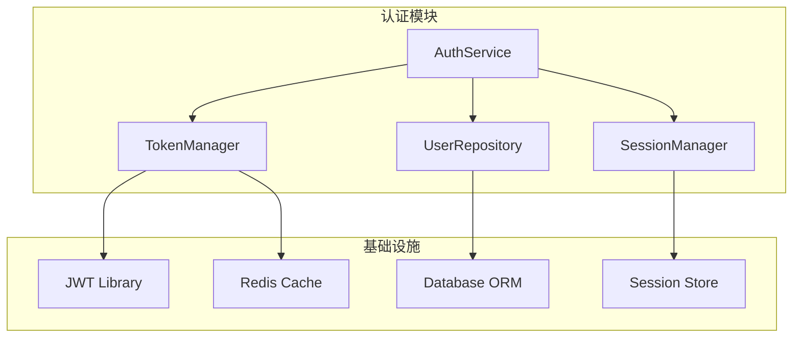

# 用户使用手册

## 1. 快速开始

### 1.1 安装

```bash
# 从源码安装
git clone git@github.com:LeeKinyou/RepoMind.git
cd RepoMind

# 创建虚拟环境并安装
uv venv --python 3.13
source .venv/bin/activate  # macOS/Linux
# .venv\Scripts\Activate.ps1  # Windows PowerShell

uv pip install -e ".[dev]"

# 配置环境变量
cp .env.example .env
# 编辑 .env 填入 LLM API Key
```

验证安装成功：

```bash
repomind --version
# repomind, version 0.1.0
```

### 1.2 三步上手

```bash
# 第一步：索引你的项目
repomind index ./my-project

# 第二步：查询代码
repomind query "用户认证流程"

# 第三步：可视化架构
repomind visualize AuthService
```

---

## 2. 命令详解

### 2.1 index — 构建索引

将代码仓库解析为结构化的索引数据，是使用其他功能的前提。

**语法**：

```bash
repomind index <path> [options]
```

**参数**：

| 参数 | 类型 | 默认值 | 说明 |
|------|------|--------|------|
| `path` | 位置参数 | 必填 | 项目目录路径 |
| `--language` | 选项 | `python` | 目标语言 |
| `--output` | 选项 | `.repomind` | 索引输出目录 |
| `--verbose` / `-v` | 标志 | `False` | 显示详细输出 |
| `--incremental` / `-i` | 标志 | `False` | 增量更新模式 |

**示例**：

```bash
# 基本用法
repomind index ./src

# 显示详细过程
repomind index ./src --verbose

# 增量更新（仅处理变更文件）
repomind index ./src --incremental

# 指定输出目录
repomind index ./src --output ./my-index
```

**输出示例**：

```
╭──────────────────────────────────────────────────────────────╮
│                    RepoMind Index Builder                     │
├──────────────────────────────────────────────────────────────┤
│                                                              │
│  📁 项目路径: ./my-project                                   │
│  🔍 扫描文件: 1,234 个 Python 文件                           │
│                                                              │
│  ⏳ 解析进度: [████████████████████████████] 100%            │
│                                                              │
│  📊 索引统计:                                                 │
│  ├── 类 (Classes):     156 个                                │
│  ├── 函数 (Functions): 2,345 个                              │
│  ├── 导入 (Imports):   4,567 条                              │
│  └── 调用 (Calls):     12,890 条                             │
│                                                              │
│  ⏱️  耗时: 12.3 秒                                           │
│  💾 存储: .repomind/ (15.6 MB)                               │
│                                                              │
╰──────────────────────────────────────────────────────────────╯
```

**注意事项**：

- 首次索引会扫描全部文件，后续使用 `--incremental` 可只处理变更文件
- 索引数据存储在项目根目录的 `.repomind/` 目录下
- 大型项目（>50 万行）首次索引可能需要数分钟

---

### 2.2 query — 智能查询

支持关键字检索、语义检索和混合检索，可自动扩展调用链。

**语法**：

```bash
repomind query <question> [options]
```

**参数**：

| 参数 | 类型 | 默认值 | 说明 |
|------|------|--------|------|
| `question` | 位置参数 | 必填 | 查询问题或关键字 |
| `--top-k` | 选项 | `10` | 返回结果数量 |
| `--expand` | 选项 | `2` | 图拓扑扩展跳数（0=不扩展） |
| `--format` | 选项 | `text` | 输出格式：`text` / `json` / `mermaid` |
| `--mode` | 选项 | `hybrid` | 检索模式：`keyword` / `semantic` / `hybrid` |
| `--output` / `-o` | 选项 | `None` | 输出到文件 |

**检索模式说明**：

| 模式 | 说明 | 适用场景 |
|------|------|---------|
| `keyword` | BM25 精确符号名匹配 | 知道确切的类名/函数名 |
| `semantic` | 向量语义相似度 | 用自然语言描述需求 |
| `hybrid` | BM25 + 向量 + 图扩展（默认） | 通用场景，效果最佳 |

**示例**：

```bash
# 基本查询（混合模式，自动扩展 2 跳）
repomind query "用户认证流程"

# 精确符号查询
repomind query "UserService.validate_token" --mode keyword

# 语义查询，不扩展
repomind query "支付处理逻辑" --mode semantic --expand 0

# 输出 Mermaid 图
repomind query "数据库连接管理" --format mermaid --output deps.md

# 输出 JSON 格式
repomind query "错误处理" --format json --output results.json

# 返回更多结果
repomind query "配置管理" --top-k 20
```

**输出示例**：

```
╭──────────────────────────────────────────────────────────────╮
│                    Query: "用户认证流程"                      │
├──────────────────────────────────────────────────────────────┤
│                                                              │
│  🔍 检索结果 (Top 5):                                        │
│                                                              │
│  1. auth/service.py::AuthService.authenticate (Score: 0.95) │
│     └── 认证服务主入口，处理登录请求                          │
│                                                              │
│  2. auth/token.py::TokenManager.verify (Score: 0.89)        │
│     └── JWT Token 验证逻辑                                   │
│                                                              │
│  3. auth/models.py::User.authenticate (Score: 0.85)         │
│     └── 用户模型认证方法                                     │
│                                                              │
│  🔗 调用链路 (2-hop):                                        │
│                                                              │
│  AuthService.authenticate                                    │
│  ├── TokenManager.verify                                     │
│  │   ├── JWT.decode                                          │
│  │   └── TokenCache.get                                      │
│  ├── User.get_by_id                                          │
│  │   └── Database.query                                      │
│  └── Session.create                                          │
│                                                              │
╰──────────────────────────────────────────────────────────────╯
```

---

### 2.3 rca — 根因分析

输入 Stack Trace 或 Issue 描述，自动定位问题根因并生成修复建议。

**语法**：

```bash
repomind rca [options]
```

**参数**：

| 参数 | 类型 | 默认值 | 说明 |
|------|------|--------|------|
| `--trace` | 选项 | `None` | Stack Trace 文件路径 |
| `--issue` | 选项 | `None` | Issue 描述文本 |
| `--sandbox` | 标志 | `True` | 启用沙箱验证 |
| `--output` / `-o` | 选项 | `None` | RCA 报告输出路径 |
| `--format` | 选项 | `text` | 输出格式：`text` / `json` / `html` |

**示例**：

```bash
# 从 Stack Trace 文件分析
repomind rca --trace error.log

# 直接粘贴 Trace 内容（通过管道）
cat error.log | repomind rca

# 从 Issue 描述分析
repomind rca --issue "支付接口返回 500 错误，偶发"

# 禁用沙箱验证（更快，但不验证修复方案）
repomind rca --trace error.log --no-sandbox

# 输出 HTML 报告
repomind rca --trace error.log --format html --output report.html
```

**Stack Trace 输入格式**：

支持标准 Python Traceback 格式：

```python
Traceback (most recent call last):
  File "app/services/payment.py", line 45, in process_payment
    result = gateway.charge(amount, token)
  File "app/gateways/stripe.py", line 78, in charge
    response = stripe.PaymentIntent.create(...)
  File "venv/lib/python3.13/stripe/api_requestor.py", line 120
    raise InvalidRequestError(message)
stripe.error.InvalidRequestError: No such token: 'tok_xxx'
```

**输出示例**：

```
╭──────────────────────────────────────────────────────────────╮
│                    Root Cause Analysis                        │
├──────────────────────────────────────────────────────────────┤
│                                                              │
│  🎯 根因定位:                                                │
│  ├── 问题文件: app/gateways/stripe.py:78                     │
│  ├── 问题函数: StripeGateway.charge                          │
│  └── 错误类型: InvalidRequestError                           │
│                                                              │
│  📊 调用链路:                                                │
│                                                              │
│  PaymentService.process_payment                              │
│  └── StripeGateway.charge                                    │
│      └── stripe.PaymentIntent.create                         │
│          └── ❌ InvalidRequestError                          │
│                                                              │
│  💡 根因分析:                                                │
│  Token 'tok_xxx' 已过期或不存在。                            │
│  可能原因：                                                  │
│  1. 前端传递了无效的 Token                                   │
│  2. Token 已被使用过                                         │
│  3. Stripe API 版本不兼容                                    │
│                                                              │
│  🔧 修复建议:                                                │
│                                                              │
│  ```diff                                                     │
│  - result = gateway.charge(amount, token)                    │
│  + try:                                                      │
│  +     result = gateway.charge(amount, token)                │
│  + except InvalidRequestError as e:                          │
│  +     if 'No such token' in str(e):                         │
│  +         raise PaymentError('Invalid payment token')       │
│  +     raise                                                │
│  ```                                                         │
│                                                              │
│  🧪 沙箱验证:                                                │
│  ├── 测试用例: test_charge_invalid_token                     │
│  ├── 执行结果: ✅ PASSED                                     │
│  └── 回归测试: ✅ 45/45 PASSED                               │
│                                                              │
╰──────────────────────────────────────────────────────────────╯
```

---

### 2.4 visualize — 架构可视化

生成代码架构的 Mermaid 可视化图表。

**语法**：

```bash
repomind visualize <symbol> [options]
```

**参数**：

| 参数 | 类型 | 默认值 | 说明 |
|------|------|--------|------|
| `symbol` | 位置参数 | 必填 | 起始符号名称（类名/函数名） |
| `--depth` | 选项 | `2` | 可视化深度 |
| `--format` | 选项 | `mermaid` | 输出格式：`mermaid` / `d3` / `dot` |
| `--type` | 选项 | `call` | 图类型：`call` / `dependency` / `inherit` / `import` |
| `--output` / `-o` | 选项 | `None` | 输出文件路径 |

**可视化类型**：

| 类型 | 说明 | 用途 |
|------|------|------|
| `call` | 函数/方法调用关系 | 理解执行流程 |
| `dependency` | 模块依赖关系 | 分析耦合度 |
| `inherit` | 类继承关系 | 理解 OOP 结构 |
| `import` | 模块导入关系 | 分析模块边界 |

**示例**：

```bash
# 生成调用图（默认）
repomind visualize AuthService

# 指定深度
repomind visualize AuthService --depth 3

# 生成依赖图
repomind visualize AuthService --type dependency

# 生成继承图
repomind visualize BaseModel --type inherit

# 输出到文件
repomind visualize AuthService --output auth_flow.md

# 输出为 DOT 格式（可用 Graphviz 渲染）
repomind visualize AuthService --format dot --output auth.dot
```

**输出示例**：



---

### 2.5 stats — 索引统计

显示当前项目的索引统计信息。

**语法**：

```bash
repomind stats [options]
```

**参数**：

| 参数 | 类型 | 默认值 | 说明 |
|------|------|--------|------|
| `--format` | 选项 | `text` | 输出格式：`text` / `json` |
| `--detailed` | 标志 | `False` | 显示详细统计 |

**示例**：

```bash
# 基本统计
repomind stats

# 详细统计
repomind stats --detailed

# JSON 格式输出
repomind stats --format json
```

**输出示例**：

```
╭──────────────────────────────────────────────────────────────╮
│                    📊 索引统计信息                            │
├──────────────────────────────────────────────────────────────┤
│                                                              │
│  📁 项目: ./my-project                                       │
│  🕐 索引时间: 2026-06-20 14:30:00                            │
│                                                              │
│  📄 文件:                                                    │
│  ├── Python 文件:   1,234 个                                 │
│  ├── 总行数:        456,789 行                               │
│  └── 总大小:        15.6 MB                                  │
│                                                              │
│  🔤 符号:                                                    │
│  ├── 类:            156 个                                   │
│  ├── 函数:          2,345 个                                 │
│  └── 方法:          3,678 个                                 │
│                                                              │
│  🔗 关系:                                                    │
│  ├── 导入关系:      4,567 条                                 │
│  ├── 调用关系:      12,890 条                                │
│  └── 继承关系:      234 条                                   │
│                                                              │
│  🧠 类型推断:                                                │
│  ├── 有类型提示:    67.8%                                    │
│  ├── 推断成功:      89.2%                                    │
│  └── 平均置信度:    0.82                                     │
│                                                              │
│  💾 存储:                                                    │
│  ├── 索引数据库:    12.3 MB                                  │
│  └── 向量存储:      3.4 MB                                   │
│                                                              │
╰──────────────────────────────────────────────────────────────╯
```

---

## 3. 高级用法

### 3.1 配置文件

在项目根目录创建 `.repomind/config.json` 可自定义行为：

```json
{
    "llm": {
        "provider": "litellm",
        "model": "claude-sonnet-4-6",
        "temperature": 0.1,
        "max_tokens": 4096
    },
    "index": {
        "ignore_patterns": [
            "**/test/**",
            "**/__pycache__/**",
            "**/venv/**",
            "**/.git/**"
        ],
        "max_file_size_mb": 5
    },
    "retrieval": {
        "default_top_k": 10,
        "default_expand_hops": 2,
        "bm25_weight": 0.4,
        "vector_weight": 0.6
    },
    "sandbox": {
        "enabled": true,
        "mode": "docker",
        "timeout_seconds": 60,
        "memory_limit_mb": 512
    },
    "performance": {
        "max_workers": 4,
        "cache_enabled": true,
        "cache_ttl_seconds": 3600
    }
}
```

### 3.2 环境变量

所有配置通过项目根目录的 `.env` 文件注入（从 `.env.example` 复制）：

```bash
cp .env.example .env
# 编辑 .env 填入你的配置
```

| 变量名 | 说明 | 默认值 |
|--------|------|--------|
| `REPOMIND_LLM_PROVIDER` | LLM 提供商 | `litellm` |
| `REPOMIND_LLM_MODEL` | LLM 模型名 | `claude-sonnet-4-6` |
| `REPOMIND_LLM_BASE_URL` | LLM API 地址 | `None` |
| `REPOMIND_LLM_API_KEY` | LLM API Key | `None` |
| `REPOMIND_SANDBOX_MODE` | 沙箱模式 | `docker` |
| `REPOMIND_INDEX_DIR` | 索引目录 | `.repomind` |
| `REPOMIND_LOG_LEVEL` | 日志级别 | `INFO` |
| `REPOMIND_MAX_WORKERS` | 并行工作线程数 | `4` |

### 3.3 与 IDE 集成

#### VS Code 集成

在 `.vscode/tasks.json` 中添加任务：

```json
{
    "version": "2.0.0",
    "tasks": [
        {
            "label": "RepoMind: Index Project",
            "type": "shell",
            "command": "repomind index ${workspaceFolder}",
            "group": "build",
            "problemMatcher": []
        },
        {
            "label": "RepoMind: Query Selection",
            "type": "shell",
            "command": "repomind query \"${selectedText}\"",
            "group": "none",
            "problemMatcher": []
        }
    ]
}
```

### 3.4 管道用法

RepoMind 支持 Unix 管道，可与其他工具组合使用：

```bash
# 从文件读取 Trace 并分析
cat error.log | repomind rca

# 查询结果输出为 JSON 并用 jq 处理
repomind query "认证" --format json | jq '.results[0]'

# 生成 Mermaid 图并用 mmdc 渲染为 PNG
repomind visualize AuthService --format mermaid | mmdc -o auth.png

# 批量查询
cat queries.txt | while read q; do repomind query "$q" --format json; done
```

---

## 4. 使用场景

### 场景 1：新人接手项目

**目标**：快速了解一个 50 万行 Python 项目的架构

```bash
# 1. 索引项目
repomind index ./big-project --verbose

# 2. 查看项目整体架构
repomind visualize MainApplication --depth 3 --type dependency

# 3. 了解核心模块
repomind query "核心业务逻辑" --top-k 10

# 4. 追踪某个功能的调用链
repomind query "用户下单流程" --expand 3

# 5. 查看统计信息
repomind stats --detailed
```

### 场景 2：生产环境故障排查

**目标**：快速定位线上报错的根因

```bash
# 1. 输入 Stack Trace 分析
repomind rca --trace production_error.log

# 2. 查看相关代码的调用链
repomind query "OrderService.process" --expand 2

# 3. 生成修复方案并在沙箱验证
repomind rca --trace production_error.log --sandbox

# 4. 输出完整报告
repomind rca --trace production_error.log --format html --output rca_report.html
```

### 场景 3：代码审查

**目标**：理解一个 PR 涉及的模块依赖

```bash
# 1. 查看修改模块的依赖关系
repomind visualize PaymentService --type dependency --depth 2

# 2. 查看修改模块的调用方（影响范围）
repomind query "PaymentService" --mode keyword --expand 2

# 3. 查看继承关系
repomind visualize PaymentService --type inherit
```

### 场景 4：架构文档生成

**目标**：自动生成项目架构文档

```bash
# 1. 生成整体依赖图
repomind visualize MainApp --type dependency --depth 3 --output arch_deps.md

# 2. 生成核心模块调用图
repomind query "核心入口函数" --format mermaid --output core_calls.md

# 3. 生成继承体系图
repomind visualize BaseModel --type inherit --depth 2 --output inheritance.md
```

---

## 5. 性能调优

### 5.1 大型项目优化

对于超过 50 万行的项目：

```json
{
    "index": {
        "ignore_patterns": [
            "**/test/**",
            "**/tests/**",
            "**/__pycache__/**",
            "**/venv/**",
            "**/node_modules/**",
            "**/migrations/**",
            "**/generated/**"
        ],
        "max_file_size_mb": 2
    },
    "performance": {
        "max_workers": 8,
        "batch_size": 100
    }
}
```

### 5.2 离线模式

完全离线运行（使用本地模型）：

```bash
# 1. 安装 Ollama
# 2. 下载模型
ollama pull deepseek-coder:6.7b

# 3. 在 .env 中配置
# REPOMIND_LLM_PROVIDER=ollama
# REPOMIND_LLM_MODEL=deepseek-coder:6.7b
# REPOMIND_LLM_BASE_URL=http://localhost:11434

# 4. 正常使用
repomind index ./my-project
repomind query "认证逻辑"
repomind rca --trace error.log
```

---

## 6. 故障排除

| 问题 | 可能原因 | 解决方案 |
|------|---------|---------|
| `索引不存在` | 未运行 index 命令 | 先执行 `repomind index <path>` |
| `符号未找到` | 符号名拼写错误或未索引 | 检查拼写，确认文件在索引范围内 |
| `LLM 调用失败` | API Key 未配置或网络问题 | 在 `.env` 中设置 `REPOMIND_LLM_API_KEY` 或切换本地模型 |
| `沙箱执行失败` | Docker 未安装或未运行 | 启动 Docker，或使用 `--no-sandbox` |
| `索引速度慢` | 项目过大或未忽略无关文件 | 配置 `ignore_patterns` 排除测试和依赖 |
| `查询结果不准确` | 索引数据过时 | 重新运行 `repomind index` 更新索引 |
| `内存不足` | 大型项目图计算占用过多内存 | 增加系统内存，或限制 `max_graph_nodes` |
